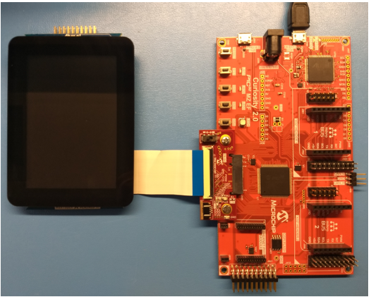

 legato_qs_mzef_cu2_cpro.X

Defining the Architecture
-------------------------

In this configuration, the application uses the External Display Controller driver setup. After the initialization phase, the application transitions into the paint phase, where it sends pixel data through the External Display Controller driver to the ILI9488 controller.

### Demonstration Features

-   External Display Controller driver
-   16-bit Parallel Interface
-   16-bit RGB Color Mode
-   Legato Graphics Library
-   Touch Input

Creating the Project Graph
--------------------------

The Project Graph diagram below shows the Harmony components that are included in this application. Lines between components are drawn to satisfy components that depend on a capability that another component provides.

Building the Application
------------------------

The parent directory for this application is gfx/apps/legato_quickstart. To build this application, use MPLAB X IDE to open the gfx/apps/legato_quickstart/firmware/legato_qs_mzef_cu2_cpro_spi.X project file.

The following table lists configuration properties:

|Project Name|BSP Used|Graphics Template Used|Description|
|:-----------|:-------|:---------------------|:----------|
|legato_qs_mzef_cu2_cpro_spi.X|PIC32MZ EF Curiosity 2.0|Legato Graphics w/ MXT Curiosity Pro Display|

> \*\*\_NOTE:\_\*\* This application may contain custom code that is marked by the comments // START OF CUSTOM CODE ... and // END OF CUSTOM CODE. When using the MPLAB Harmony Configurator to regenerate the application code, use the "ALL" merging strategy and do not remove or replace the custom code.

Configuring the Hardware
------------------------

The final setup should be:

Configure the hardware as follows:

-   Connect the [24-bit Passthrough Graphics Adapter](https://www.microchip.com/Developmenttools/ProductDetails/AC320213) to the PIC32MZ EF Curiosity board.

**NOTE:** This is not the same as the [RGB565 interface board](https://www.microchip.com/Developmenttools/ProductDetails/AC320212) that is packaged with the PIC32MZ EF Curiosity board.  The 24-bit Passthought Graphcis Adapter comes packaged with the [SAM E54 Curiosity Ultra Development Board](https://www.microchip.com/Developmenttools/ProductDetails/DM320210) and the [PIC32 MZ DA Development Kit](https://www.microchip.com/developmenttools/ProductDetails/PartNO/EV87D54A).

- Set the S1 switch on the 24-bit Passthrough GFX Adapter board to 2. At this switch position, the S1 switch allows the Write pin to the external display controller to be driven from the EBIWE pin. This was provisioned to enhance performance since the WE pin can now be controlled by the EBI peripheral instead of a bit-banged GPIO pin.

-   Connect the maXTouch Curiosity Pro Display to the 24-bit Passthrough Graphics Adapter using the appropriate ribbon cable

-   The IM switches on the display backside should be set to 010b for 16-bit MCU/parallel mode

-   Power up the board by connecting the a micro USB cable to the Debug USB connector on the Curiosity board.

Running the Demonstration
-------------------------

Once the board is powered on, the application will run and show the following image on the display panel.

* * * * *

 
