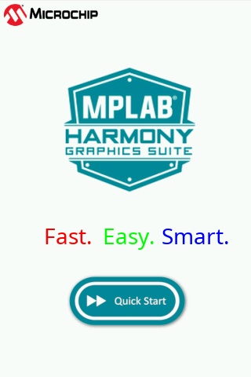

 legato_qs_mzef_cu2_cpro_spi.X

Defining the Architecture
-------------------------

In this configuration, the application uses the LE External Controller to interface with an ILI9488 based SPI display module. After the initialization phase, the application transitions into the paint phase, where it sends pixel data through the LE External Controller driver to the external display controller (ILI9488) via SPI.

### Demonstration Features

-   ILI9488 Display Controller (SPI-based)
-   16-bit RGB Color Mode
-   Legato Graphics Library
-   Touch Input

Creating the Project Graph
--------------------------

The Project Graph diagram below shows the Harmony components that are included in this application. Lines between components are drawn to satisfy components that depend on a capability that another component provides.

Building the Application
------------------------

The parent directory for this application is gfx/apps/legato_quickstart. To build this application, use MPLAB X IDE to open the gfx/apps/legato_quickstart/firmware/legato_qs_mzef_cu2_cpro_spi.X project file.

The following table lists configuration properties:

|Project Name|BSP Used|Graphics Template Used|Description|
|:-----------|:-------|:---------------------|:----------|
|legato_qs_mzef_cu2_cpro_spi.X|PIC32MZ EF Curiosity 2.0|Legato Graphics w/ MXT Curiosity Pro Display|

> \*\*\_NOTE:\_\*\* This application may contain custom code that is marked by the comments // START OF CUSTOM CODE ... and // END OF CUSTOM CODE. When using the MPLAB Harmony Configurator to regenerate the application code, use the "ALL" merging strategy and do not remove or replace the custom code.

Configuring the Hardware
------------------------

Configure the hardware as follows:

- Connect a 20-pin FRC cable to J501/EXT1 on the PIC32MZ EF Curiosity board. 
- Connect the FRC cable to J3 on the maXTouch Curiosity Pro display, making sure Pin 1 on J3 matches Pin 1 on J501.

- Set the DIP switch SW1 on the maXTouch Curiosity Pro display to 111 to enable 4-Wire SPI Mode.

- On older revisions of the board, the LCD backlight pin in not connected on J501. So, Pin 7 on J501/EXT1 should be manually pulled up to 3.3V as shown in the image below.

- Few maXTouch Curiosity Pro displays may have missing resistors as shown below. If this is the case, you will need to remove the populated 0 Ohm resistor and populate three 10k 0603 SMD pull-down resistors before swithing IM2 on SW1 to 'On'.

Running the Demonstration
-------------------------

- Power up the board by connecting the a micro USB cable to the Debug USB connector on the PIC32MZ EF Curiosity board.
- Once the application is downloaded, it will show the following image on the display panel.

* * * * *

 
