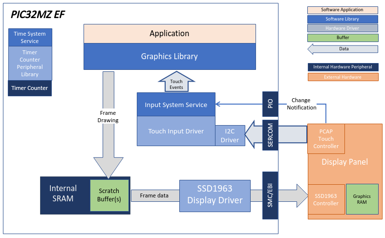
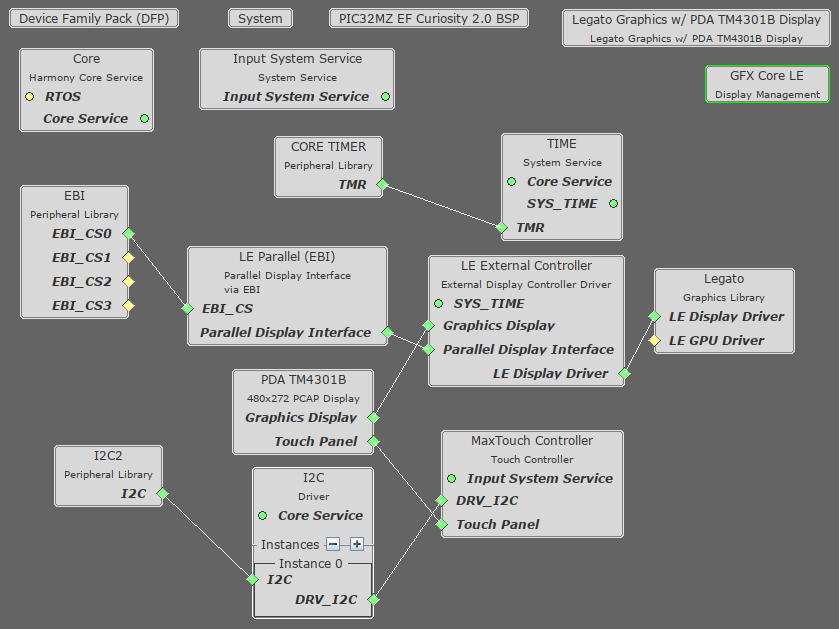
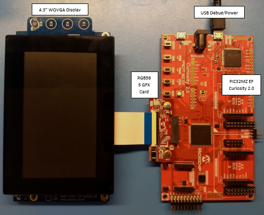

 legato_qs_mzef_cu_tm4301b_ssd1963.X

Defining the Architecture
-------------------------

In this configuration, the application uses the SSD1963 driver setup. After the initialization phase, the application transitions into the paint phase, where it sends pixel data through the SSD1963 driver to the external display controller.

### Demonstration Features

-   SSD1963 Display Controller
-   16-bit RGB Color Mode
-   Legato Graphics Library
-   Touch Input

Creating the Project Graph
--------------------------

The Project Graph diagram below shows the Harmony components that are included in this application. Lines between components are drawn to satisfy components that depend on a capability that another component provides.

Building the Application
------------------------

The parent directory for this application is gfx/apps/legato_quickstart. To build this application, use MPLAB X IDE to open the gfx/apps/legato_quickstart/firmware/legato_qs_mzef_cu_tm4301b_ssd1963.X project file.

The following table lists configuration properties:

|Project Name|BSP Used|Graphics Template Used|Description|
|:-----------|:-------|:---------------------|:----------|
|legato_qs_mzef_cu_tm4301b_ssd1963.X|PIC32MZ EF Curiosity 2.0|Legato Graphics w/ PDA TM4301B Display|

> \*\*\_NOTE:\_\*\* This application may contain custom code that is marked by the comments // START OF CUSTOM CODE ... and // END OF CUSTOM CODE. When using the MPLAB Harmony Configurator to regenerate the application code, use the "ALL" merging strategy and do not remove or replace the custom code.

Configuring the Hardware
------------------------

The final setup should be:

Configure the hardware as follows:

-   Connect the RGB565 Graphics Adapter to the PIC32MZ EF Curiosity board.
-   Connect the PDA TM4301B display to the RGB565 Graphics Adapter using the appropriate ribbon cable.
-   Power up the board by connecting the a micro USB cable to the Debug USB connector on the Curiosity board.

Running the Demonstration
-------------------------

Once the board is powered on, the application will run and show the following image on the display panel.

* * * * *

 
