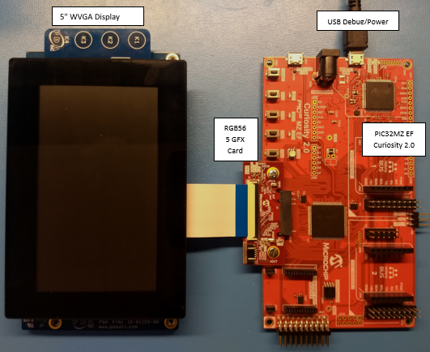
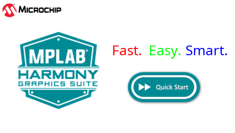

 legato_qs_mzef_cu_tm5000.X

Defining the Architecture
-------------------------

In this configuration, the application uses the 8-bit LUT (Look Up Table) Low Cost Controllerless (LCC) driver setup. After the initialization phase, the application transitions into the paint phase, where it draws an image to the frame buffer. The graphics driver stores an internal frame buffer and the application uses a gfx_driver API to write pixel data directly to the frame buffer memory address.

The LCC driver continuously refreshes the display panel with data from the frame buffer and the images are shown on the display.

### Demonstration Features

-   Controllerless display driver
-   8-LUT 16-bit RGB Color Mode Frame Buffer in SRAM memory
-   Legato Graphics Library
-   Touch Input

Creating the Project Graph
--------------------------

The Project Graph diagram below shows the Harmony components that are included in this application. Lines between components are drawn to satisfy components that depend on a capability that another component provides.

Building the Application
------------------------

The parent directory for this application is gfx/apps/legato_quickstart. To build this application, use MPLAB X IDE to open the gfx/apps/legato_quickstart/firmware/legato_qs_mzef_cu_tm5000.X project file.

The following table lists configuration properties:

|Project Name|BSP Used|Graphics Template Used|Description|
|:-----------|:-------|:---------------------|:----------|
|legato_qs_mzef_cu_tm5000.X|PIC32MZ EF Curiosity 2.0|Legato Graphics w/ PDA tm5000 Display|

> \*\*\_NOTE:\_\*\* This application may contain custom code that is marked by the comments // START OF CUSTOM CODE ... and // END OF CUSTOM CODE. When using the MPLAB Harmony Configurator to regenerate the application code, use the "ALL" merging strategy and do not remove or replace the custom code.

Configuring the Hardware
------------------------

The final setup should be:

Configure the hardware as follows:

-   Connect the RGB 565 Graphics Adapter to the PIC32MZ EF Curiosity board.
-   Connect the PDA tm5000 display to the RGB 565 Graphics Adapter using the appropriate ribbon cable.
-   Power up the board by connecting the a micro USB cable to the Debug USB connector on the Curiosity board.

Running the Demonstration
-------------------------

Once the board is powered on, the application will run and show the following image on the display panel.

* * * * *

 
