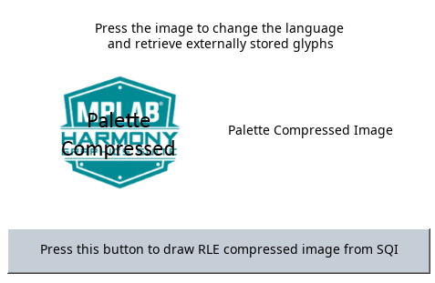
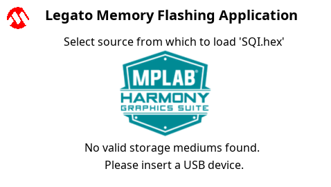
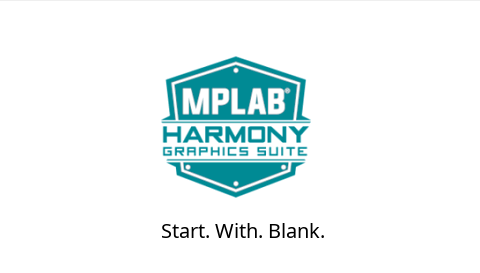

# Example Applications

The following applications are provided to demonstrate both basic and advanced Graphics capabilities of the PIC32 MZ EF Family.

## Legato Library Examples 

* [Legato Quickstart](./legato_quickstart/readme.md)

This application provides a touch-enabled starting point for the legato graphics library.

* [Legato Quickstart External Resources](./legato_quickstart_ext_res/readme.md)

This application demonstrates how to use the Legato Graphics Library to retrieve externally stored assets.

* [Legato Flash](./legato_flash/readme.md)

This application demonstrates how to flash data to internal storage memory using USB or SD Card.  It can also be used as a simple flashing tool for other applications.

* [Legato Adventure](./legato_adventure/readme.md)

This application demonstrates basic user input and sprite animation.

## Blank Library Examples

This application demonstaates a simple way to create and run a custom graphics application that directly uses Legato-based GLCD graphics controller driver

* [Blank Quickstart](./blank_quickstart/readme.md)

